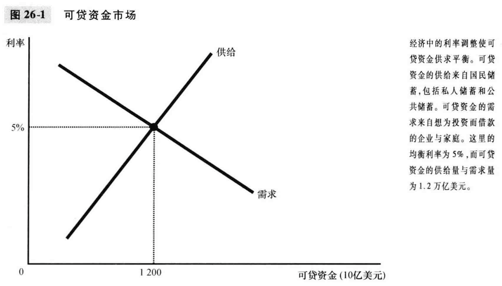
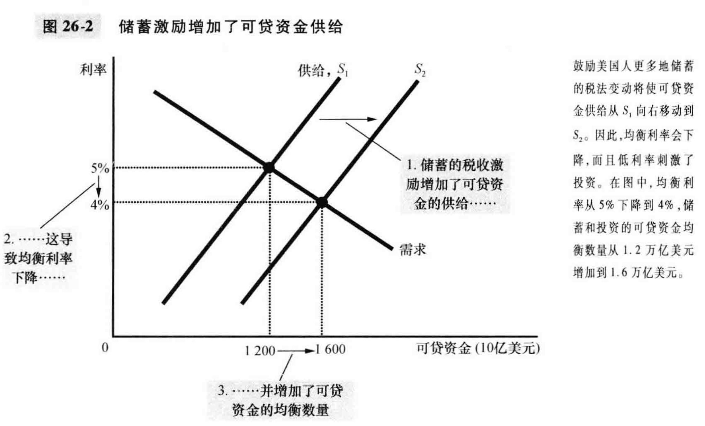
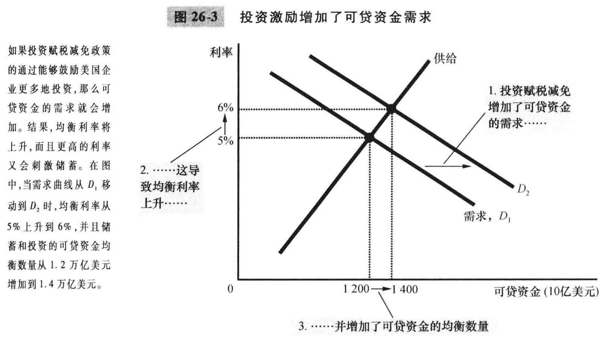
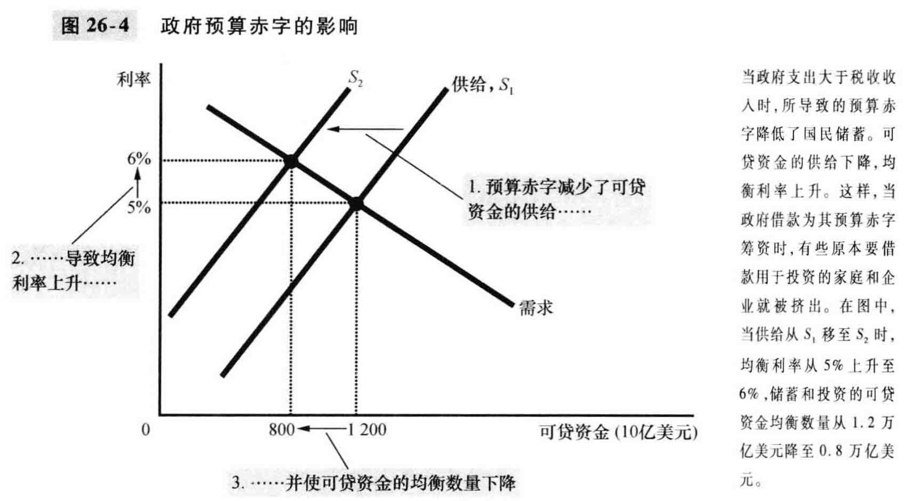

#  26 章 储蓄、投资和金融体系

金融体系：经济中促使一个人的储蓄与另一个人的投资相匹配的一组机构

- 美国经济中的金融机构
  - 金融市场：想储蓄的人可以借以直接向想借款的人提供资金的机构
    - 金融市场中最重要的两种是债券市场和股票市场
      - (Lxx): 公司缺钱需要募集资金的时候，要么借钱(债券市场)，即债务融资；要么出售公司所有权(股票市场)，即权益融资
    - 债券市场：
      - 债券是规定借款人对债券持有人负有债务责任的证明；规定到期日与利率
        - 期限
          - 短则几个月，长则30年，甚至有永久债券
          - 长期债券风险高，所以利率高
        - 信用风险
          - 拖欠：借款人不能支付利息或本金；
          - 借款人可以通过破产来拖欠贷款
          - 举例1：政府债券风险低，因而利率低
          - 举例2：财务状况不稳定的公司可以通过发行垃圾债券来筹集资金，但利率极高；债券购买者可以根据标准普尔等评级机构给出的评级来判断不同债券的信用风险
        - 税收待遇
          - 大多数债券的利息应交纳所得税
          - 地方政府发行的市政债券不用交税，因而利率更低
    - 股票市场
      - 股票：企业部分所有权的索取权
      - 与债券相比，股票风险更高，但潜在收益也更高
      - 股票持有者可以在股票市场上交易股票；证券交易所如美国的纽交所、NASQ，国内的上交所、深交所
      - 股票价格由公司股票的供求状况决定，反映了人们对于一个公司未来盈利性的预期
      - 股票指数：计算出来的一组股票价格的平均数；如美国的道琼斯指数、标普500，中国的沪深300、中证500
      - 炒股看啥数字
        - 价格
        - 红利：公司把利润分红给股东；红利收益率：红利/股价
        - 价格-收益比(P/E): 股价/每股收益
  - 金融中介机构
    - 金融中介机构：储蓄者可以借以间接地向借款者提供资金的金融机构
    - 银行
      - 小杂货商很难在债券市场与股票市场上筹资，最有可能通过向银行贷款来扩大生产
      - 银行吸取存款，发放贷款；赚取两种利率的差额
      - 银行还有一种作用：允许人们根据自己的存款开支票以及使用借记卡使物品与服务的购买更加便利；即银行创造出一种人们可以作为交换媒介的特殊资产
    - 共同基金
      - 共同基金：向公众出售股份，并用收入来购买股票与债券资产组合的机构
      - 优点一：持有一种股票或债券的风险极大，多元化的资产组合风险较小；小股民钱不多也可以持有多元化的资产组合；
      - 优点二:  共同基金使普通人获得专业资金管理者的服务
      - 指数基金: 共同基金的一种，按照一个既定的股票指数购买所有股票
- 国民收入账户中的储蓄与投资
  - 一些重要的恒等式
    - 国民储蓄(简称储蓄)：在用于消费和政府购买后剩下的一个经济中的总收入
    - 对于一个封闭经济体
      - Y = C + I + G，即GDP = 消费 + 投资 + 政府购买
      - S = I = Y - C - G = (Y - T - C) + (T - G)，T代表税收
      - 即：国民储蓄 = 投资 = 私人储蓄 + 公共储蓄
      - 公共储蓄大于零，有预算盈余；公共储蓄小于零，有预算赤字
  - 储蓄与投资的含义
    - 对整个经济而言，储蓄等于投资；但是对个人而言，不一定相等
- 可贷资金市场
  - 我们假设经济中只有一个金融市场，称为可贷资金市场，用来简化分析问题

  - 可贷资金市场：想储蓄的人借以提供资金、想借钱投资的人借以借贷资金的市场

  - 可贷资金的供给与需求

    - 	供给：储蓄
        需求：投资
         	利率调整可以使得可贷资金供需平衡(这里的利率指的是真实利率)
         	

  - 政策1：储蓄激励

    - 	美国储蓄率较低；提高储蓄率会提高GDP增长；可以通过减少对利息的征税来鼓励储蓄；
        如果税法改革鼓励更多储蓄，则利率下降且投资增加
         	

  - 政策2：投资激励

    - 	投资赋税减免
        如果税法改革鼓励更多投资，则利率上升且储蓄增加
         	

  - 政策3：政府预算赤字与盈余

    - (我们模型中的可贷资金指为私人投资筹资可得到的资源流量，因而政府出现预算赤字时而筹资时，减少了可贷资金的供给)

    - 挤出：由于政府借款而引起的投资减少

    - 当政府通过预算赤字减少了国民储蓄时，利率就会上升且投资减少；因而降低了经济增长率；

    - 反之，预算盈余增加了可贷资金供给，降低了利率，并刺激了投资；因而有更多的资本积累和更快的经济增长

    - 