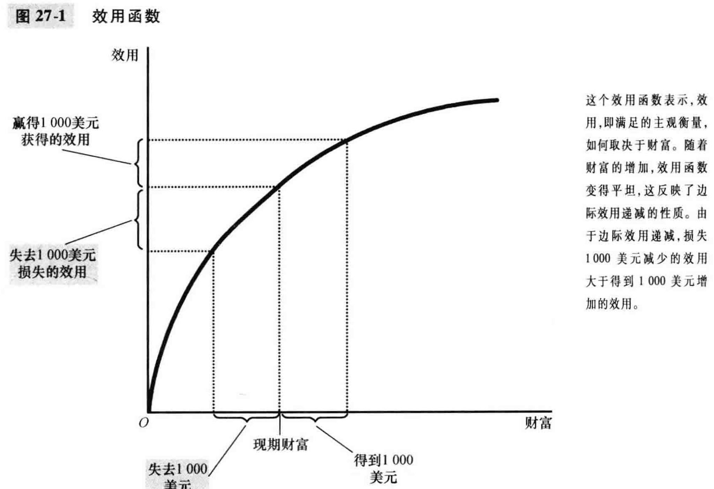
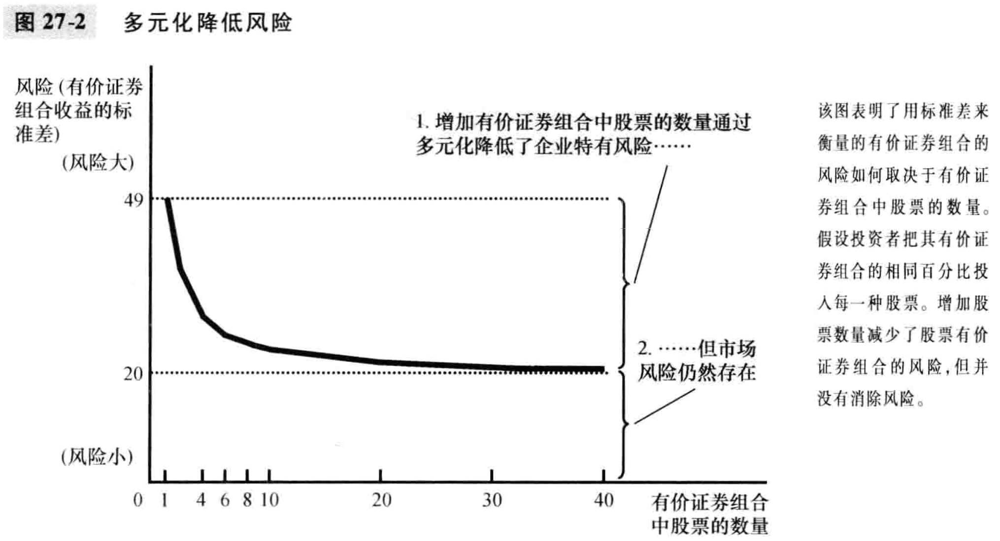
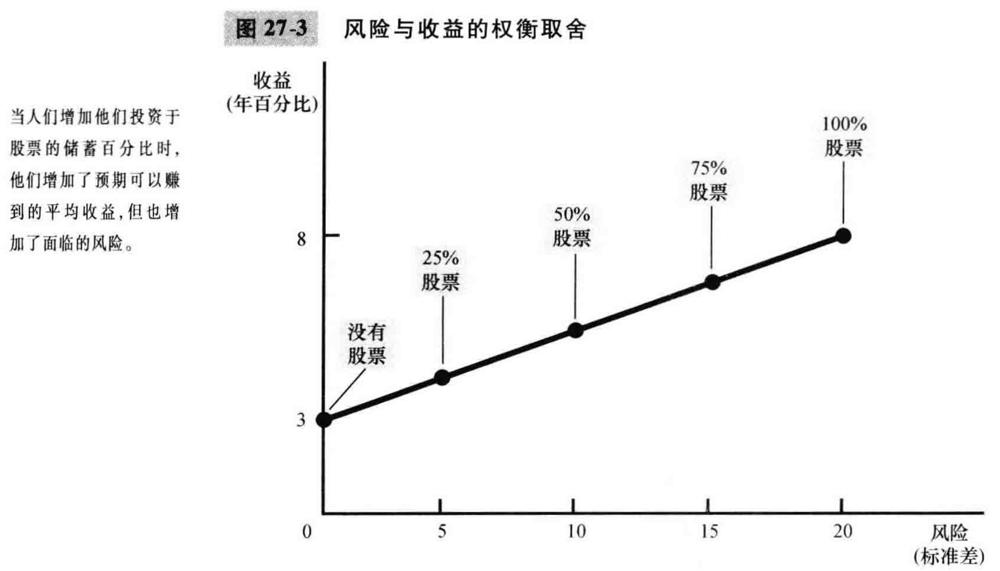

# 27章 金融学的基本工具

金融决策中两个至关重要的要素：时间和风险；本章从这两个角度分别分析

### 现值：衡量货币的时间价值

- 一些基本概念或常识
  - 今天的钱比未来同样数量的钱更值钱
  - 现值(present value)：用现行利率产生一定量未来货币所需要的现在货币量
  - 终值(future value)：在现行利率既定时，现在货币量将带来的未来货币量
  - 复利(compounding): 赚得的利息仍留在账户上以赚取未来更多的利息
  - 设利率为r, 则N年后得到的X量的现值是 $X/(1+r)^N$
  - 贴现：寻找未来一定量未来货币现值的过程
  - 简便计算：70规则；如果一个量每年增长$x\%$, 则该变量翻一翻需要$70/x$年

### 风险管理

- 风险厌恶

  - 风险厌恶：不喜欢不确定性；大部分人是风险厌恶的
  - 效用：一个人对福利或满足的主观衡量
  - 由于边际效用递减，失去钱的损失效用大于赢得等价钱的效用，因此人们是风险厌恶者。
  - 
- 保险市场

  - 面临风险的人向保险公司支付一笔保险费，作为回报，保险公司同意接受所有或部分风险
  - 举例：车险、火灾险、医疗保险、人寿保险、养老保险
  - 对整个经济而言，保险的作用并不是消除风险，而是更有效地分摊风险
  - 困扰
    - 逆向选择：高风险的人比低风险的人更可能申请保险
    - 道德风险：人们在购买保险之后，对他们谨慎从事以规避风险的激励小了
    - (Lxx)保险公司无法很好地区分不同客户，也无法监测客户的风险行为, 所以AI+大数据有用武之地
- 企业持有风险的多元化

  - 不要把鸡蛋放在一个篮子里

  - 多元化：通过用大量不相关的小风险代替一种风险来降低风险

    - 例子
      - 保险市场，通过多元化降低了风险
      - 购买金融资产，多元化持有资产组合
    - 
    - 股票有价证券组合的风险随着股票数量的增加而大大降低
    - 企业持有风险：只影响一家公司的风险
    - 市场风险：影响股市上所有公司的风险
    - 多元化可以消除企业持有风险但不能消除市场风险
- 风险与收益的权衡取舍
  - 虽然持有多元化有价证券组合依然有固有风险，但从历史上来看，股票收益率远高于债券和银行储蓄账户等金融资产，所以风险厌恶者依然愿意购买
  - 股票与安全资产(债券等)组合中，股票比例越高，收益越高，但风险也越高
  - 

### 资产评估

- 基本面分析(fundamental analysis)
  - 基本面分析：为决定一家公司的价值而对其会计报表和未来前景进行研究
  - 即综合考虑很多因素对一家公司的股价进行估值，如果股票被低估，则买入
- 有效市场假说
  - 有效市场假说：认为资产价格反映了关于一种资产价值的所有公开的、可获得的信息的理论
  - 根据这一理论，股票市场是信息有效的，股票价格应该随机游走。即股价变动不可预测，干脆不用做分析，随便购买多元化的有价证券组合就好
  - 实例: 
    - 美国市场上，积极管理的基金大部分(84%)不能战胜指数基金，因为频繁交易以及报酬费
    - 有效市场假说认为，胜过市场不可能；美国金融市场实证也表明，胜过市场极为困难；所以有效市场假说虽然不准确，但是包含了大量的真理成分
- 市场非理性
  -  股票价格有时会贝利其真实价值的理性预期
