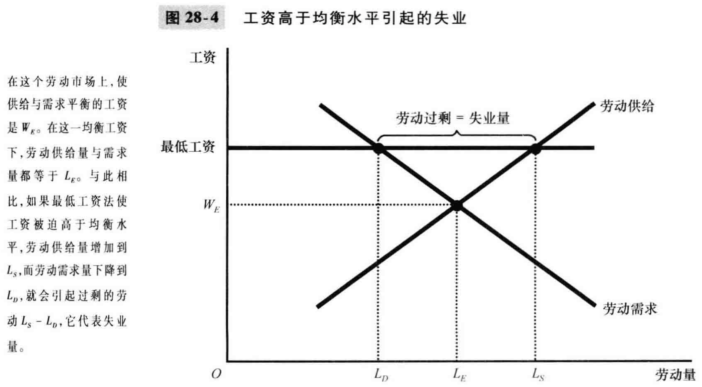

# 28章 失业

### 失业的确认

- 如何衡量失业
  - 成年人口 = 劳动力 + 非劳动力(如全日制学生、家务劳动者、退休人员)
  - 劳动力参工率 = 劳动力/ 成年人口
  - 劳动力 = 就业者人数 + 失业者人数
  - 失业率 = 失业者人数 / 劳动力
  - 自然失业率：失业率围绕它儿波动的正常失业率
  - 周期性失业：失业率对自然失业率的背离
- 失业率衡量了我们想要衡量的内容吗
  - 官方失业率有用但不完善
  - 区分失业者与非劳动力很困难，进入与退出劳动力队伍极为常见
- 失业者没有工作的时间有多长
  - 大多数失业是短期的，而在任何一个既定时间段所观察到的大多数失业又是长期的
  - (Lxx) 按人次统计，大部分失业者很快会找到工作，即大多数失业是短期的；但是按固定时间段统计，大部分失业者是那些少数的长期没有工作的工人造成的，即观察到的失业是长期的
- 为什么有些人总是失业者
  - 摩擦性失业：由于工人寻找最适合自己嗜好和技能的工作需要时间而引起的失业
    - 通常可以解释较短的失业持续时间
  - 结构性失业：由于某些劳动市场上可提供的工作岗位数量不足以每个想工作的人提供工作而引起的失业
    - 通常可以解释较长的失业持续时间

### 寻找工作

寻找工作：使工人与适当工作相匹配

- 为什么一些摩擦性失业是不可避免的
  - 因为经济总是处于变动之中
  - 部门转移：各行业或各地区之间的需求构成变动
  - 举例：制造业岗位逐渐减少，新兴行业就业岗位逐渐增加，工人在切换工作时就产生了摩擦性失业
- 公共政策和寻找工作
  - 如果公共政策可以减少 失业工人招新工作的时间就可以降低自然失业率
    - 政府管理的就业机构及时发布职位空缺信息
    - 公共培训计划，教技能
  - 私人机构也可以实现上述功能
- 失业保险
  - 失业保险：当工人失业时为他们提供部分收入保障的政府计划
  - 失业保险减轻了失业的痛苦，但也增加了失业量，因为人们找工作的努力程度下降
  - 大多数经济学家认为，取消失业保险会减少失业量

### 最低工资法

- 最低工资法迫使工资高于均衡水平，增加了劳动供给量，减少了劳动需求量，因而会有人失业

- 最低工资法对于不熟练工人和经验最少的工人有重要意义，如青少年

- 如果工资由于任何一种原因高于均衡水平，就会导致失业

  

### 工会和集体谈判

- 工会经济学
  - 加入工会的员工往往可以得到更高的工资
  - 但这样相当于把工资提高到均衡水平上，会导致失业
  - 相当于使部分工人收益，部分工人遭受损失
- 工会对经济是好还是坏
  - 有利有弊，众说纷纭

### 效率工资理论

效率工资：企业为提高工人的生产率而支付的高于均衡水平的工作

提高了工资，同样使得劳动供给大于劳动需求，造成失业。

为什么企业愿意支付高工资？

- 工人健康：高工资使员工身体越棒，效率越高
- 工人流动率：高工资使得员工跳槽少，企业成本低
- 工人素质：高工资有利于吸引出高素质的工人
- 工人努力程度：高工资可以激励员工更努力