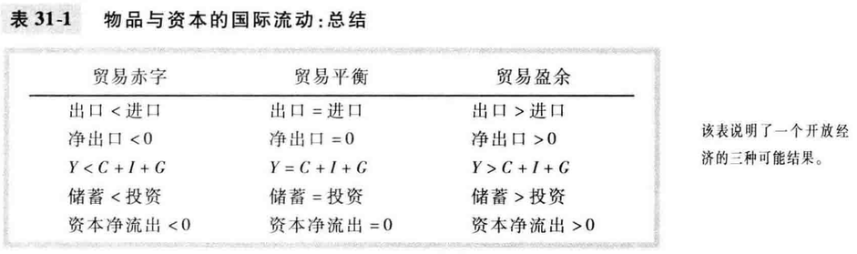

# 31章 开放经济的宏观经济学：基本概念

### 物品与资本的国际流动

- 物品的流动：出口、进口以及净出口

  - 净出口又叫贸易余额，等于出口减进口
  - 贸易盈余、贸易赤字、贸易平衡

- 金融资源的流动：资本净流出

  - 资本净流出 = 本国居民购买的外国资产 - 外国人购买的本国资产
  - 形式
    - 国外直接投资
    - 国外有价证券投资

- 净出口与资本净流出相等

  - 当一国有贸易盈余时，资本从一国流出
  - 当一国有贸易赤字时，资本流入国内

- 储蓄、投资及其与国际流动的关系

  - 储蓄 = 国内投资 + 资本净流出（之前的分析中，在封闭经济内，储蓄等于投资）

- 总结

  

### 国际交易的价格：真实汇率与名义汇率

- 名义汇率
  - 一个人可以用一国的货币交换另一国的货币的比率
- 真实汇率
  - 一个人可以用一国的物品与服务交换另一国的物品与服务的比率
  - 真实汇率 = 名义汇率 * 国内价格 / 国外价格
  - 真实汇率下降，出口增加，进口减少；反之类似

### 第一种汇率决定理论：购买力平价

购买力平价：任何一单位通货应该能在所有国家买到等量物品

- 基本逻辑
  - 根据一价定律得出，一种物品在所有地方都应该以相同的价格售出，否则就存在套利机会
- 含义
  - 名义汇率 = 外国物价水平(用外国通货单位衡量) / 国内物价水平(用国内通货单位衡量)
  - 当中央银行印发大量货币时，该国通货相对其他通货贬值
- 局限性
  - 许多物品是不容易贸易的，如理发
  - 即使是可贸易物品，当它们在不同国家生产时，也并不总能完全替代
