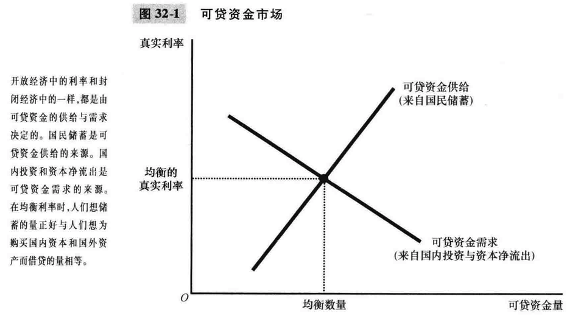
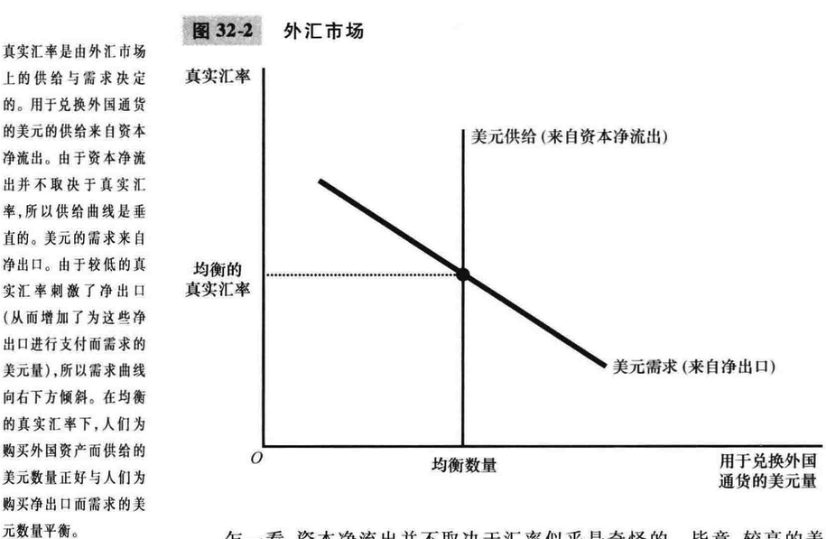
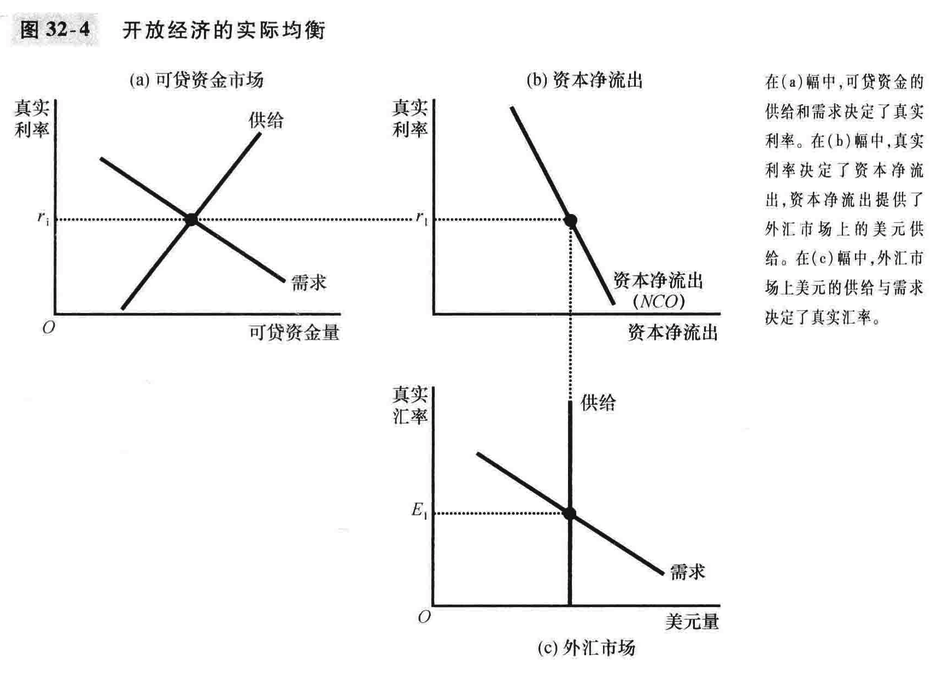
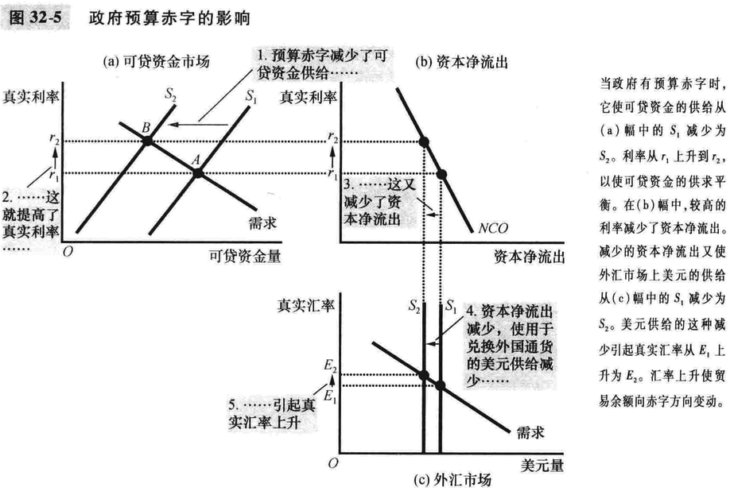
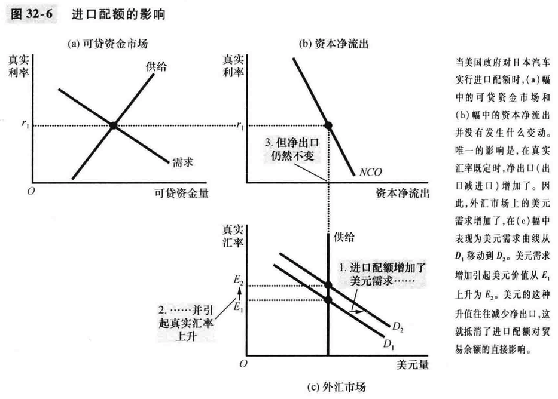
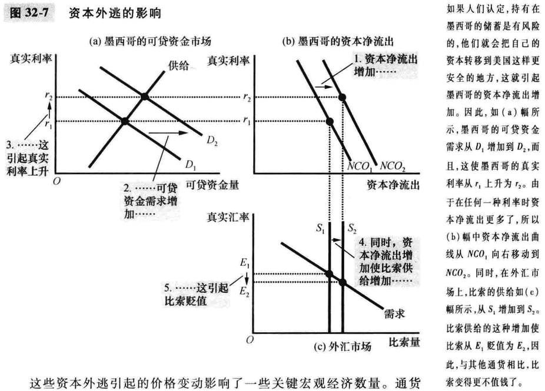

# 32章 开放经济的宏观经济理论

### 可贷资金市场与外汇市场的供给与需求

- 可贷资金市场
  - 一国的高真实利率会降低资本净流出
  - 
- 外汇市场
  - 当一国真实汇率上升时，其国内物品价格高，会导致出口减少，进口增加，减少了外汇市场上的该国货币的需求量
  - 
  - 汇率变动及影响购买外国资产的成本，也影响拥有这些资产的收益，两种影响相互抵消。资本净流出并不取决与真实汇率。
  - 在均衡的真实汇率下，由美国物品与服务净出口所引起的外国人对美元的需求正好与由美国资本净流出所引起的来自美国人的美元供给相平衡

### 开放经济中的均衡

- 资本净流出：两个市场之间的联系
- 两个市场的同时均衡
- 

### 政策和时间如何影响开放经济

- 政府预算赤字
  - 提高了真实利率，挤出了国内投资，引起美元升值，并使贸易余额向赤字方向变动
  - 
- 贸易政策
  - 关税；进口配额
  - 
  - 贸易政策并不影响一国的总体贸易余额，但是会影响某些企业、行业和其他国家
- 政治不稳定与资本外逃
  - 